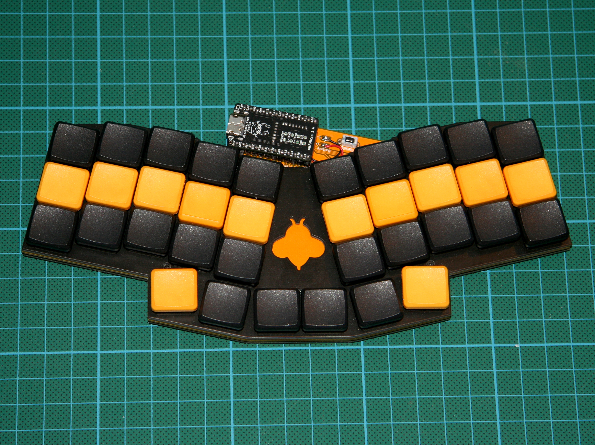
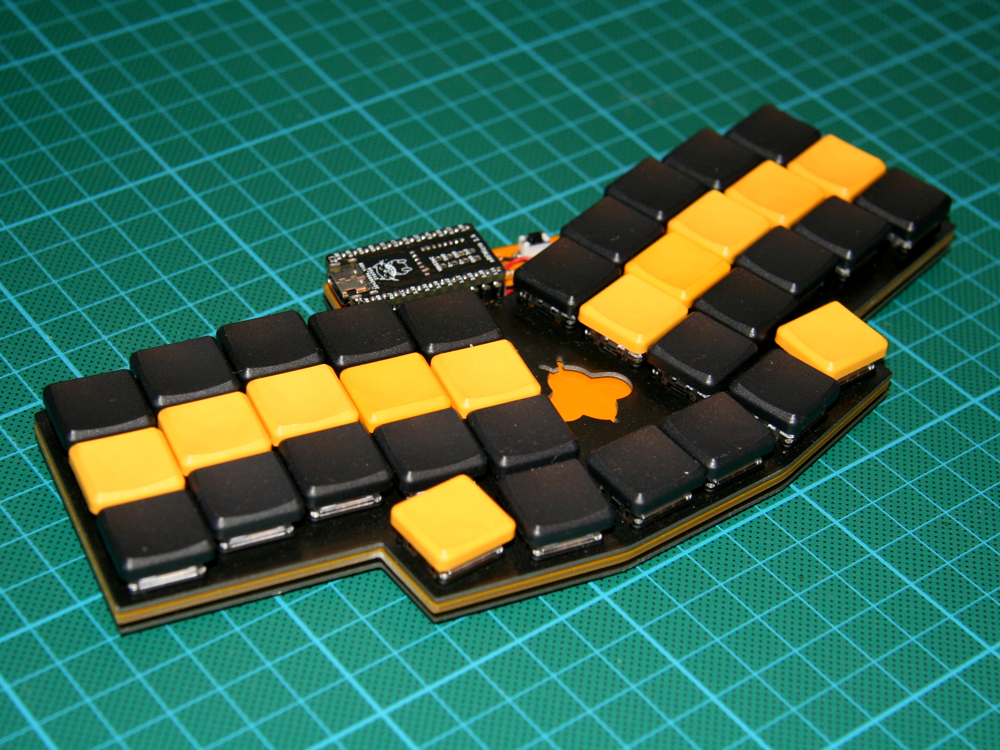
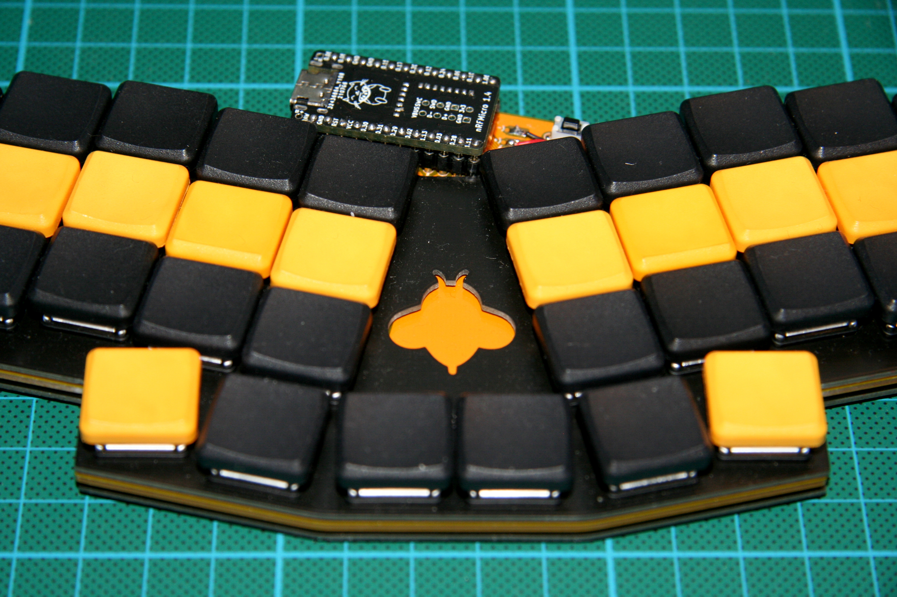

# Humla-HS (with Choc hotswap sockets)
Because I find myself wanting to experiment with different types of Choc v1 switches, I've modified the original [Humla keyboard](https://github.com/jimmerricks/humla) with Choc v1 hotswap sockets.

##Original text:
The Humla is a 36-key low profile keyboard based on [the Reviung by gtips](https://github.com/gtips/reviung/) and [the Rev-lp by cyril279](https://github.com/cyril279/keyboards/tree/main/revlp). It is for choc switches (with 18x17mm spacing) and has basic support for bluetooth pro micro alternatives such as the [nRFMicro](https://github.com/joric/nrfmicro). Humla means blumblebee in Swedish.

## 3D printed cases

- Basic [case](./case) with cover by [@zzeneg](https://github.com/zzeneg)
- Laptop [adapter](https://github.com/Lenbok/scad-keyboard-cases/tree/master/humla) and bumper by [@Lenbok](https://github.com/Lenbok)
